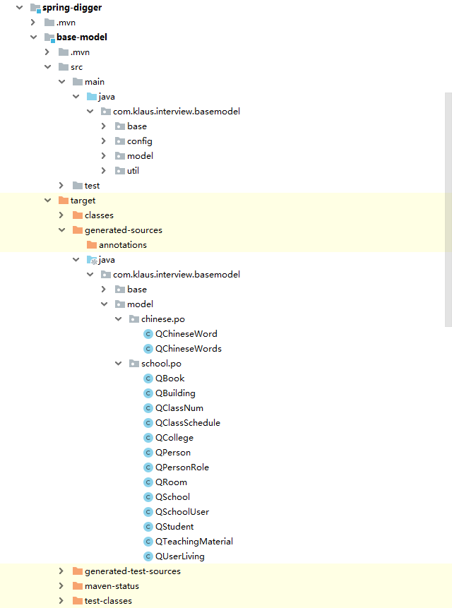
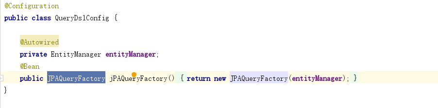
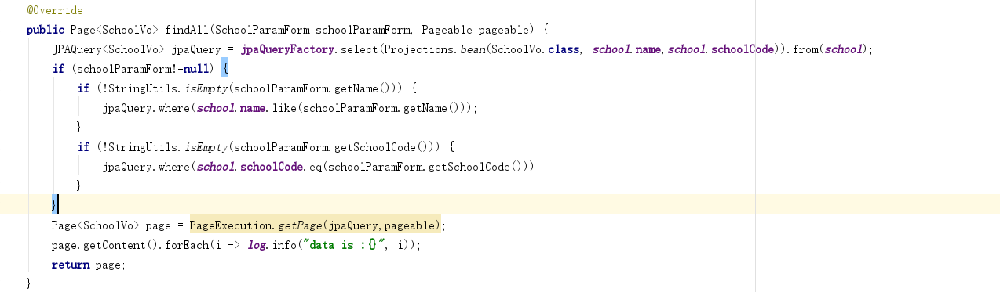

# schedule


## es集成/ELK

## kafka 集成

## 分布式ID生成工具/反向解码


## redis分布式锁 [20191118]


## jvm相关 [20191118]
- memory相关的溢出示例
- j-util排查相关问题


## jpa 集成queryDSL [20191112]
- queryDSL 与 JOOQ 比较
```


```
## 实现
- 引入jar，在pom。xml文件中引入如下jar包，同时添加插件
```
        <!--QueryDSL支持-->
        <dependency>
            <groupId>com.querydsl</groupId>
            <artifactId>querydsl-jpa</artifactId>
        </dependency>
        <dependency>
            <groupId>io.swagger</groupId>
            <artifactId>swagger-annotations</artifactId>
            <version>1.5.20</version>
            <scope>provided</scope>
        </dependency>


        <plugin>
            <groupId>com.mysema.maven</groupId>
            <artifactId>apt-maven-plugin</artifactId>
            <version>1.1.3</version>
            <executions>
                <execution>
                    <goals>
                        <goal>process</goal>
                    </goals>
                    <configuration>
                        <outputDirectory>target/generated-sources/java</outputDirectory>
                        <processor>com.querydsl.apt.jpa.JPAAnnotationProcessor</processor>
                    </configuration>
                </execution>
            </executions>
        </plugin>
```
- 编译代码生成相应的生成模板类
```
mvn clean compile
```
- 查看target/generated-sources/java录下是否生成对应的 Q-pattern.java文件

- 注入JPAQueryFactory Bean

- case

```
curl -X POST "http://fun-nearby:9090/school/expore?size=2" -H "accept: */*" -H "Content-Type: application/json" -d "{ \"name\": \"\u9ed1\u9f99\u6c5f\u5927\u5b66\u0037\u0025\"}" -i
```


```


