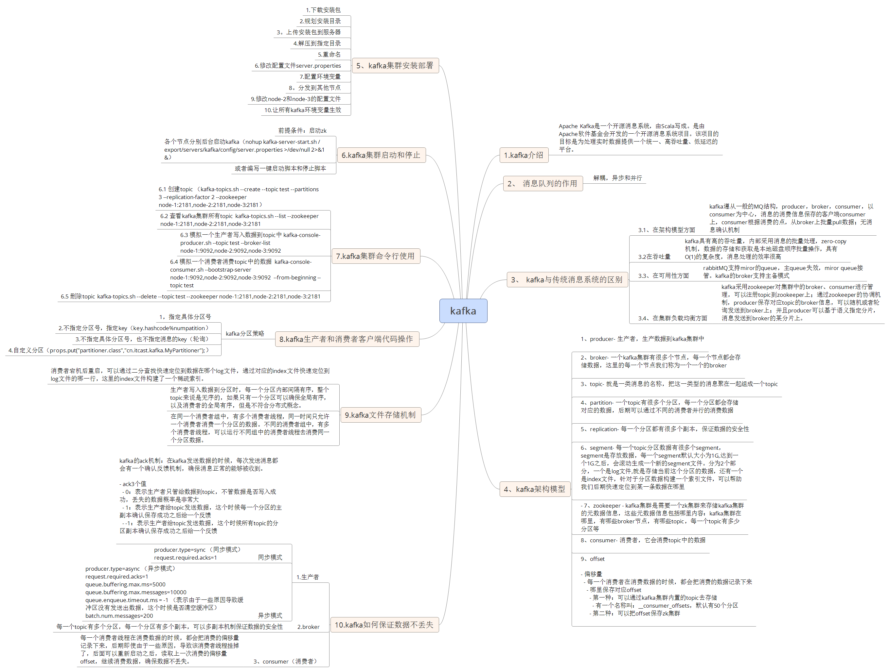

# docker kafka learning

## run in local
- docker-compose.yaml
```
version: '2'
services:
  zookeeper:
    image: wurstmeister/zookeeper
    ports:
      - "2181:2181"
  kafka:
    image: wurstmeister/kafka:1.1.0
    ports:
            - "9092"
    environment:
      KAFKA_ADVERTISED_HOST_NAME: 192.168.43.235
      KAFKA_ZOOKEEPER_CONNECT: zookeeper:2181
      KAFKA_DELETE_TOPIC_ENABLE: "true"
    volumes:
      - /var/run/docker.sock:/var/run/docker.sock
    links:
      - zookeeper


```
- running
```aidl
docker-compose up -d --scale kafka=3
```

## run some test
```
./kafka-topics.sh --zookeeper zookeeper:2181 --list
./kafka-topics.sh --zookeeper zookeeper:2181 --describe --topic school-topic
./kafka-console-consumer.sh --topic school-topic --bootstrap-server 127.0.0.1:9092 --from-beginning --consumer.config ../config/consumer.properties
./kafka-console-consumer.sh --topic school-topic-2 --bootstrap-server 127.0.0.1:9092 --offset latest --partition 0 --consumer.config ../config/consumer.properties

```


## kafka 相关配置含义
- auto-offset-reset
```
earliest
当各分区下有已提交的offset时，从提交的offset开始消费；无提交的offset时，从头开始消费
latest
当各分区下有已提交的offset时，从提交的offset开始消费；无提交的offset时，消费新产生的该分区下的数据
none
topic各分区都存在已提交的offset时，从offset后开始消费；只要有一个分区不存在已提交的offset，则抛出异常
```


## 相关思维导图



